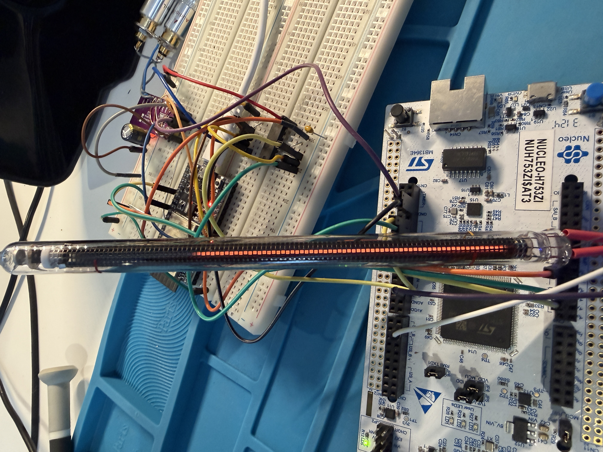

# 42dB DSP Engine for STM32H753 / STM32F446VET6

Real-time audio DSP processor running on STM32H753ZI (Nucleo-144), receiving I2S audio from ESP32 Bluetooth A2DP sink, with BLE GATT control interface.

The Nucleo was used as prototyping board in the early stages as this was the only suitable at hand.
The project is designed to be run on a STM32F446VET6 on a custom board also carrying the I2S master (Microchip BM83 doing A2DP, capable of AAC encoding), an ESP32 for BLE GATT and general control of the board, and DAC like PCM5102A or any othe I2S DAC.

**Version:** 0.5.0 | **Build:** 59 | **Date:** 2026-02-18

## Overview

This project implements a DSP audio engine that sits between a Bluetooth audio source (ESP32 running A2DP sink or something like Microchip BM83) and an I2S DAC. The STM32H753 receives audio over I2S via SAI1, applies real-time DSP processing (EQ, loudness, compression, etc.), and outputs to a PCM5102A DAC.

Control commands are received via BLE GATT on the ESP32, which relays them over UART to the STM32. The STM32 replies with the new DSP state so the ESP32 can update its BLE status characteristics.

I created an iPhone and Apple Watch app to control the DSP. Volume control is done by hardware volume control on the player.
This way you can always control the DSP no matter what device is playing music over Bluetooth (or any other means) to the device.

This STM32 DSP engine is part of a three-project ecosystem — see [Related Projects](#related-projects) below.


```
Current setup (ESP32 A2DP):

┌──────────┐   Bluetooth   ┌─────────┐   I2S (SAI1)  ┌────────────┐   I2S     ┌──────────┐
│  Phone   │──────A2DP────>│  ESP32  │──────────────>│  STM32H753 │─────────>│ PCM5102A │
│          │               │         │               │ DSP Engine │          │   DAC    │
│  42dB    │   BLE GATT    │         │   UART        │            │          │          │
│   App    │──────────────>│         │──────────────>│            │          │          │
└──────────┘               └─────────┘               └────────────┘          └──────────┘
```

```
Planned setup (BM83 A2DP):

┌──────────┐   Bluetooth   ┌─────────────────┐   I2S      ┌────────────┐   I2S     ┌──────────┐
│  Phone   │──────A2DP────>│ BM83SM1-00AB    │──────────>│  STM32H753 │─────────>│ PCM5102A │
│          │               │ (I2S master,    │            │ DSP Engine │          │   DAC    │
│          │               │  crystal clock) │            │            │          │          │
│  42dB    │   BLE GATT    ├─────────────────┤   UART     │            │          │          │
│   App    │──────────────>│     ESP32       │──────────>│            │          │          │
└──────────┘               └─────────────────┘            └────────────┘          └──────────┘
```

The BM83 runs as a standard A2DP sink out-of-the-box (no custom firmware) with a crystal-driven I2S master clock for stable audio. The ESP32 handles BLE GATT control (and potentially a display) — easy to program and no expensive development SDK required, making it practical for small production batches.

## Features

- **Real-time DSP Processing** at 44.1kHz, 16-bit stereo
- **Presets**: OFFICE, FULL, NIGHT (volume capped), SPEECH
- **Loudness**: Low-shelf +6dB @ 150Hz bass boost
- **Bass Boost**: Low-shelf +8dB @ 100Hz for small speakers
- **Normalizer/DRC**: Dynamic range compression (2:1, threshold -12dB)
- **Volume/Trim**: Device-side volume with perceptual dB curve
- **Duck Mode**: Panic button -12dB instant reduction
- **Mute**: Zero output
- **Bypass**: Skip all DSP (direct passthrough)
- **Sine Test**: Internal 1kHz tone generator for DAC/amp verification (0x0A)
- **Fixed Headroom**: -9dB always applied, prevents volume jumps when toggling effects
- **IN-13 VU Meter**: Nixie bargraph tube driven by DAC showing real-time audio RMS level

## Hardware Requirements

### Microcontroller
- **STM32H753ZI Nucleo-144** (or any STM32H753 with sufficient pins)

### Audio Components
- **ESP32-WROOM-32** running Bluetooth A2DP sink firmware (v2.4.x)
- **PCM5102A** I2S DAC module (or equivalent)
- **74HCT04** hex inverter IC (required for I2S signal buffering — see below)

### VU Meter Components
- **IN-13** Soviet neon bargraph tube
- **MPSA42** NPN high-voltage transistor (300V)
- **4.7KΩ 1W** resistor (anode current limit)
- **100KΩ** resistor (auxiliary cathode to anode)
- **1KΩ** resistor (DAC to transistor base)
- **10KΩ** resistor (base pull-down — required, prevents false triggering)
- **270Ω** resistor (emitter degeneration)
- **140-170V DC** power supply (ZVS boost converter + rectifier + 10µF 200V filter cap)

### Why 74HCT04 Buffer?

The STM32 GPIO inputs load the ESP32 I2S signals too much when connected directly. The 74HCT04 (double-inverter per signal = non-inverting buffer) provides:
- High input impedance (doesn't load ESP32)
- 5V output levels (STM32 is 5V tolerant on I/O)
- Clean signal edges

**Note:** The PCM5102A DAC receives BCLK and LRCK directly from the ESP32 (not through the STM32). Only the STM32 input path uses the 74HCT04 buffer.

## Wiring

### I2S Audio Path

```
ESP32 I2S Output:
ESP32 BCLK (GPIO26) ──┬── PCM5102A BCK (direct)
                      └── 74HCT04 (2 stages) ── STM32 PE5 (SAI1_A SCK)

ESP32 LRCK (GPIO25) ──┬── PCM5102A LRCK (direct)
                      └── 74HCT04 (2 stages) ── STM32 PE4 (SAI1_A FS)

ESP32 DATA (GPIO22) ───── 74HCT04 (2 stages) ── STM32 PE6 (SAI1_A SD)

STM32 PE3 (SAI1_B SD) ─── PCM5102A DIN
```

**Important PCM5102A Notes:**
- SCK pin **must** be grounded (internal PLL mode — floating causes noise)
- FMT pin: LOW = I2S Philips format
- XSMT pin: HIGH = unmuted

### UART Control Path (BLE GATT Relay)

```
ESP32 GPIO4 (TX) ──── STM32 PD6 (USART2 RX)
ESP32 GPIO5 (RX) ──── STM32 PD5 (USART2 TX)
GND ───────────────── GND
```

### Power

```
5V ──┬── ESP32 VIN
     ├── 74HCT04 VCC
     └── PCM5102A VIN

3.3V ── STM32 (from Nucleo regulator)
```

## Pin Summary

| Function | STM32 Pin | AF | Nucleo Header | Notes |
|----------|-----------|----|---------------|-------|
| SAI1_A SCK (I2S BCLK in) | PE5 | AF6 | CN9-18 | From 74HCT04 buffer |
| SAI1_A FS (I2S LRCK in) | PE4 | AF6 | CN9-16 | From 74HCT04 buffer |
| SAI1_A SD (I2S Data in) | PE6 | AF6 | CN9-20 | From 74HCT04 buffer |
| SAI1_B SD (I2S Data out) | PE3 | AF6 | CN9-14 | To PCM5102A DIN |
| USART2 TX (to ESP32) | PD5 | AF7 | CN9-6 | ESP32 UART RX (GPIO5) |
| USART2 RX (from ESP32) | PD6 | AF7 | CN9-4 | ESP32 UART TX (GPIO4) |
| USART3 TX (Debug VCP) | PD8 | AF7 | ST-LINK | Serial console 115200 |
| USART3 RX (Debug VCP) | PD9 | AF7 | ST-LINK | Serial console 115200 |
| DAC1_OUT1 (VU meter) | PA4 | Analog | CN7-17 | To MPSA42 base via 1KΩ |

### IN-13 VU Meter Circuit

```
+140V ─── R1 (4K7 1W) ───┬─── IN-13 Anode (yellow mark)
                          │
                    R4 (100KΩ)
                          │
                    IN-13 Auxiliary Cathode (red mark)

                    IN-13 Cathode (middle pin)
                          │
                    MPSA42 Collector
                    MPSA42 Base ─── R2 (1KΩ) ─── STM32 PA4 (DAC1_OUT1)
                          │
                    R5 (10KΩ) to GND   ← base pull-down (required)
                          │
                    MPSA42 Emitter ─── R3 (270Ω) ─── GND
```

**IN-13 Pin Identification:**
- **Yellow mark** = Anode (connects to nickel mesh inside tube)
- **Middle pin** = Main cathode (120mm molybdenum rod)
- **Red mark** = Auxiliary cathode (short ~2mm starter electrode)

**Operating Notes:**
- Control range: 770mV (DAC=956, 0%) to 1840mV (DAC=2283, 100%) at PA4
- Tube requires prime burst at startup (100% for 50ms) to ensure glow starts from bottom
- 10KΩ base pull-down prevents false triggering from MPSA42 high gain
- 100KΩ from auxiliary cathode to anode ensures reliable bottom-up glow initiation
- Below 770mV: DAC output = 0 (tube fully off, avoids unreliable glow region)

## Building and Flashing

### Prerequisites

- ARM GCC toolchain (`arm-none-eabi-gcc`)
- ST-Link utilities (`st-flash`)
- Make

### Build

```bash
make
```

Build number auto-increments in `Core/Inc/build_number.h`.

### Flash

```bash
./flash.sh
# or manually:
st-flash --reset write build/42dB_DSP_Engine.bin 0x8000000
```

### Debug Console

```bash
# Linux
screen /dev/ttyACM0 115200

# macOS
screen /dev/cu.usbmodem* 115200
```

Connect to the ST-LINK VCP (USART3) for debug output. The console prints buffer counts, DSP state changes, DMA status, and startup diagnostics every second.

## GATT Command Protocol

Commands are relayed from ESP32 over UART in format:
```
GATT:CTRL:<hex_bytes>\r\n
```

The parser also accepts `GATT:TRL:` (tolerant of single-byte UART loss).

### Command Reference

| CMD | Name | Value | Description |
|-----|------|-------|-------------|
| `0x01` | SET_PRESET | `0x00-0x03` | OFFICE / FULL / NIGHT / SPEECH |
| `0x02` | SET_LOUDNESS | `0x00`/`0x01` | Loudness OFF/ON (+6dB @ 150Hz) |
| `0x04` | SET_MUTE | `0x00`/`0x01` | Unmute/Mute |
| `0x05` | SET_DUCK | `0x00`/`0x01` | Duck OFF/ON (-12dB) |
| `0x06` | SET_NORMALIZER | `0x00`/`0x01` | DRC OFF/ON |
| `0x07` | SET_VOLUME | `0x00-0x64` | Volume 0-100% |
| `0x08` | SET_BYPASS | `0x00`/`0x01` | DSP Bypass OFF/ON |
| `0x09` | SET_BASS_BOOST | `0x00`/`0x01` | Bass Boost OFF/ON (+8dB @ 100Hz) |
| `0x0A` | SET_SINE_TEST | `0x00`/`0x01` | Sine test OFF/ON (1kHz internal tone) |

### Preset Values

| Value | Preset | Description |
|-------|--------|-------------|
| `0x00` | OFFICE | Subtle high-shelf +1.5dB @ 6kHz |
| `0x01` | FULL | Low-shelf +4dB @ 120Hz + high-shelf +3dB @ 8kHz |
| `0x02` | NIGHT | Low-shelf -3dB @ 150Hz + volume capped at 60% |
| `0x03` | SPEECH | High-pass @ 150Hz + peak +3dB @ 2.5kHz |

### Example Commands

```
GATT:CTRL:0100  → Preset OFFICE
GATT:CTRL:0101  → Preset FULL
GATT:CTRL:0102  → Preset NIGHT (volume capped at 60%)
GATT:CTRL:0103  → Preset SPEECH
GATT:CTRL:0201  → Loudness ON
GATT:CTRL:0401  → Mute ON
GATT:CTRL:0501  → Duck ON (-12dB)
GATT:CTRL:0601  → Normalizer ON
GATT:CTRL:073C  → Volume 60% (0x3C = 60)
GATT:CTRL:0801  → Bypass ON (passthrough)
GATT:CTRL:0901  → Bass Boost ON
GATT:CTRL:0A01  → Sine Test ON (1kHz tone, ignores I2S input)
GATT:CTRL:0A00  → Sine Test OFF
```

## DSP Architecture

### Signal Chain

```
I2S Input ──────────────────────────────────────────────┐
    │                                                   │
    ▼                                                   ▼
[BYPASS: memcpy passthrough]          ┌──────────────────────┐
    │                                 │  VU Meter RMS        │
    ▼  [Normal path]                  │  (pre-DSP, from RX)  │
┌─────────────────┐                   └──────────┬───────────┘
│  Preset EQ      │                              │
└────────┬────────┘                              ▼
         │                             ┌──────────────────────┐
         ▼                             │  DAC1 → PA4          │
┌─────────────────┐                   │  → MPSA42 → IN-13    │
│  Loudness       │  +6dB @ 150Hz     └──────────────────────┘
└────────┬────────┘
         │
         ▼
┌─────────────────┐
│  Bass Boost     │  +8dB @ 100Hz
└────────┬────────┘
         │
         ▼
┌─────────────────┐
│  Normalizer/DRC │  2:1 ratio, -12dB threshold
└────────┬────────┘
         │
         ▼
┌─────────────────┐
│  Volume + Trim  │  ← -9dB fixed headroom + perceptual curve
└────────┬────────┘
         │
         ▼
┌─────────────────┐
│  Duck           │  ← -12dB reduction (when enabled)
└────────┬────────┘
         │
         ▼
┌─────────────────┐
│  Mute           │  ← Zero output (when enabled)
└────────┬────────┘
         │
         ▼
┌─────────────────┐
│  Limiter        │  ← Hard clip at ±1.0 (safety)
└────────┬────────┘
         │
         ▼
I2S Output
```

**Sine Test mode** (`0x0A 0x01`) bypasses the entire chain: a 1kHz tone at -12dB is generated internally and fed directly to the TX buffer, ignoring I2S input. Useful for verifying the DAC and amplifier independently of the Bluetooth source.

### Preset EQ Curves

| Preset | Description | Filter 1 | Filter 2 |
|--------|-------------|----------|----------|
| OFFICE | Subtle clarity | High-shelf +1.5dB @ 6kHz | — |
| FULL | Enhanced bass+treble | Low-shelf +4dB @ 120Hz | High-shelf +3dB @ 8kHz |
| NIGHT | Reduced bass, vol cap 60% | Low-shelf -3dB @ 150Hz | — |
| SPEECH | Voice clarity | High-pass @ 150Hz | Peak +3dB @ 2.5kHz |

### Loudness Filter

Low-shelf boost for enhancing bass at low listening volumes:
- **Frequency:** 150 Hz
- **Gain:** +6 dB
- **Q:** 0.707 (Butterworth)

### Bass Boost Filter

Additional low-frequency boost for small speakers:
- **Frequency:** 100 Hz
- **Gain:** +8 dB
- **Slope:** 0.7

### Normalizer/DRC Parameters

Transparent dynamic range compression:
- **Threshold:** -12 dB
- **Ratio:** 2:1 (gentle, no pumping)
- **Attack:** ~10 ms
- **Release:** ~80 ms
- **Makeup Gain:** +3 dB

### Volume/Trim Curve

Perceptual (logarithmic) mapping:

| Trim | dB (before headroom) |
|------|---------------------|
| 100 | 0 dB |
| 80 | -6 dB |
| 60 | -12 dB |
| 40 | -20 dB |
| 20 | -35 dB |
| 0 | -60 dB (near-mute) |

Fixed -9dB headroom is always applied to prevent clipping when effects are enabled.

## Technical Details

### Audio Configuration

- Sample Rate: 44100 Hz
- Bit Depth: 16-bit
- Channels: Stereo (interleaved L/R)
- Buffer: 256 samples per channel per half-buffer
- Latency: ~5.8 ms per buffer half (~12 ms round-trip)

### SAI Configuration (I2S)

**SAI1_A (RX — input from ESP32, Slave Receiver):**
- Pins: PE5 (SCK/AF6), PE4 (FS/AF6), PE6 (SD/AF6)
- Mode: Slave RX (clock provided by ESP32)
- ClockStrobing: Rising edge (sample data on rising BCLK)
- Protocol: I2S Philips (FS before first bit)
- Sync: Asynchronous

**SAI1_B (TX — output to PCM5102A DAC, Slave Transmitter):**
- Pin: PE3 (SD/AF6)
- Mode: Slave TX (synchronized to SAI1_A)
- ClockStrobing: Falling edge (output data on falling BCLK)
- Protocol: I2S Philips
- Sync: Synchronous with SAI1_A

**TX DMA Start Alignment:**
TX DMA is started from within the first `HAL_SAI_RxCpltCallback` (not at boot). When RxCplt fires, the RX DMA just wrapped to position 0, so starting TX here gives zero initial offset. This eliminates the race condition that would otherwise cause drift to grow to ±512 samples (~85 sec) and then resync.

### DMA Configuration

- RX: DMA1_Stream0, circular mode, half/full callbacks
- TX: DMA1_Stream1, circular mode, started from first RxCplt
- Both buffers placed in D2 SRAM (required for DMA1/DMA2 on STM32H7)

### Interrupt Priorities

Critical for reliable UART reception during audio processing:

| Interrupt | Priority | Notes |
|-----------|----------|-------|
| USART2 (BLE commands) | 0 | Highest — never miss commands |
| DMA1_Stream0 (Audio RX) | 2 | Lower — can be preempted |
| DMA1_Stream1 (Audio TX) | 2 | Lower — can be preempted |

### Memory Placement

DMA1/DMA2 on STM32H7 can ONLY access D2 SRAM (0x30000000). Audio buffers must be placed there:

```c
__attribute__((section(".RAM_D2"))) int16_t audio_rx_buffer[...];
__attribute__((section(".RAM_D2"))) int16_t audio_tx_buffer[...];
```

## Project Structure

```
42dB_H753_DSP_engine/
├── Core/
│   ├── Inc/
│   │   ├── build_number.h      # Auto-incremented build number
│   │   ├── stm32h7xx_hal_conf.h
│   │   └── stm32h7xx_it.h
│   └── Src/
│       ├── main.c              # Main application + DSP processing
│       ├── stm32h7xx_hal_msp.c # Peripheral GPIO/clock init (pin AF assignments)
│       ├── stm32h7xx_it.c      # Interrupt handlers
│       └── system_stm32h7xx.c  # System initialization
├── Drivers/
│   ├── CMSIS/                  # ARM CMSIS headers
│   └── STM32H7xx_HAL_Driver/   # ST HAL library
├── ESP32_BT-SPKR-DSP-001_BLE_GATT-2.4.1/  # ESP32 firmware snapshot (v2.4.1)
├── STM32H753XX_FLASH.ld        # Linker script (D2 SRAM section)
├── Makefile
├── flash.sh                    # Flashing script
├── Protocol.md                 # BLE GATT protocol specification
├── README.md                   # This file
└── TECHNICAL.md                # Detailed technical documentation
```

## Changelog

### v0.5.0 (2026-02-18)
- Migrated I2S from SAI2 (PD pins) to SAI1 (PE5/PE4/PE6/PE3) for Nucleo-144 compatibility
- Fixed TX DMA alignment: TX now starts from first RxCplt callback, eliminating race condition and long-term drift
- Added sine test mode (command 0x0A) — internal 1kHz tone at -12dB for DAC/amp verification
- Disabled DMA resync in favour of drift monitoring only (hard restart caused worse glitches than drift)
- Matched ESP32 v2.4.1/2.4.3 firmware with correct Bypass/Bass Boost BLE status bit assignments

### v0.4.0 (2026-02-14)
- IN-13 nixie bargraph VU meter driven by DAC1 (PA4)
- MPSA42 current sink with measured calibration (770mV–1840mV)
- RMS-based level detection with asymmetric attack/release
- Sqrt compression for natural VU response across music genres
- Startup prime burst ensures reliable bottom-up glow initiation
- VU meter works in all modes including bypass

### v0.3.0 (2026-02-06)
- Implemented all DSP features: presets, loudness, bass boost, normalizer, duck, mute, bypass
- Fixed volume cap for NIGHT preset (non-destructive)
- Tuned DRC for transparent compression (no pumping)
- Fixed headroom approach (-9dB) prevents volume jumps

### v0.2.0 (2026-02-04)
- I2S passthrough working with 74HCT04 buffer
- UART command reception with interrupt priority fix
- Basic loudness and mute

### v0.1.0 (2026-02-03)
- Initial SAI/DMA configuration
- Debug console via ST-LINK VCP

## Troubleshooting

### No Audio Output

1. Check PCM5102A SCK is grounded (internal PLL mode)
2. Verify ESP32 is playing audio (check with scope on GPIO26/25)
3. Check 74HCT04 power (5V) and signal routing to PE5/PE4/PE6
4. Verify BCLK/LRCK go to both STM32 (via buffer) and DAC (direct)
5. Check debug console — should show "Buffers/sec: 172" when audio is flowing

### Distorted Audio

1. Check I2S format matches (Philips, 16-bit)
2. Verify volume/trim not too high with effects enabled (max ~70% with bass boost + loudness)
3. Check for ground loops (use common ground throughout)

### UART Commands Not Working

1. Check interrupt priorities (UART must be priority 0, DMA priority 2)
2. Verify ESP32 GPIO4 (TX) → STM32 PD6 (RX) wiring
3. Check baud rate matches (115200)
4. Look at debug console — received commands are logged as `[GATT] CTRL: XX XX`

### Volume Drops When Enabling Effects

Ensure you are on v0.3.0 or later. The fixed -9dB headroom approach means effects never cause a perceived volume drop.

### IN-13 Tube Not Lighting

1. Verify HV supply is 140–170V
2. Check MPSA42 orientation (not reversed)
3. Verify 10KΩ base pull-down is in place
4. Scope PA4 — should show ~770mV at quiet, ~1840mV at loud music
5. If tube starts in middle (not bottom), prime burst may have failed — check startup log

## Related Projects

This firmware is one of three projects that form the **42dB audio system**:

| Project | Repository | Role |
|---------|-----------|------|
| **42dB STM32 DSP Engine** (this repo) | [ChaoticVolt-42dB_STM32_DSP_engine](https://github.com/MYBLtd/ChaoticVolt-42dB_STM32_DSP_engine) | Real-time audio DSP processor |
| **42dB iPhone & Apple Watch App** | [ChaoticVolt-42_Decibels-iPhone-and-WatchOS-app](https://github.com/MYBLtd/ChaoticVolt-42_Decibels-iPhone-and-WatchOS-app) | BLE GATT control interface |
| **ESP32 BT-SPKR firmware** | Snapshot included in this repo (`ESP32_BT-SPKR-DSP-001_BLE_GATT-2.4.x/`) | A2DP Bluetooth sink + GATT relay |

### How They Fit Together

```
┌──────────────────────┐   BLE GATT    ┌──────────────┐   UART (GATT relay)   ┌─────────────────┐
│  iPhone / Apple Watch │──────────────>│    ESP32     │──────────────────────>│  STM32H753      │
│  42dB App             │               │  A2DP sink   │                       │  DSP Engine     │
│                       │               │  GATT relay  │<──────────────────────│  (this project) │
└──────────────────────┘               └──────┬───────┘   status reply        └────────┬────────┘
                                              │ I2S audio                               │ I2S audio
                                              └───────────────────────────────────────>│ PCM5102A DAC
```

The DSP processing runs entirely on the STM32 — the ESP32 acts as a Bluetooth A2DP sink and GATT relay only.

### Version Compatibility

The three projects communicate over a shared **UART/BLE protocol** (command format `GATT:CTRL:<hex>`). When the protocol changes, all three must be updated together. Use this table to find known-good combinations:

| Protocol | STM32 DSP Engine | ESP32 Firmware | iPhone/Watch App |
|----------|-----------------|----------------|-----------------|
| v1 | v0.3.0 – v0.5.x | v2.4.1 – v2.4.3 | check app repo |

> **Rule of thumb:** If you update one project and a feature stops working, check that the other two are on a compatible protocol version. Each project's changelog notes which protocol version it targets.

## License

PolyForm Noncommercial 1.0.0 — See [LICENSE.txt](LICENSE.txt). Commercial use requires explicit written permission.

## Author

Robin Kluit

## References

- [Audio EQ Cookbook](https://www.w3.org/2011/audio/audio-eq-cookbook.html) — Robert Bristow-Johnson's biquad filter formulas
- [STM32H753 Reference Manual (RM0433)](https://www.st.com/resource/en/reference_manual/rm0433)
- [STM32H7 SAI Application Note (AN5543)](https://www.st.com/resource/en/application_note/an5543)
- [STM32H7 DMA Application Note (AN4031)](https://www.st.com/resource/en/application_note/an4031)
- [Special thanks to Andreas Spiess:](https://youtu.be/5DG0-_lseR4?si=OCAofh8rW4z6m_Xm) - Andreas inspired me to speed up my workflow further with Claude AI. I hate to do documentation, AI save a lot of time doing this for me.

## Maintenance

This repo currently does not accept external pull requests. Please use Issues or Discussions for reports and suggestions.

## Fun

Early stage development hardware setup:


